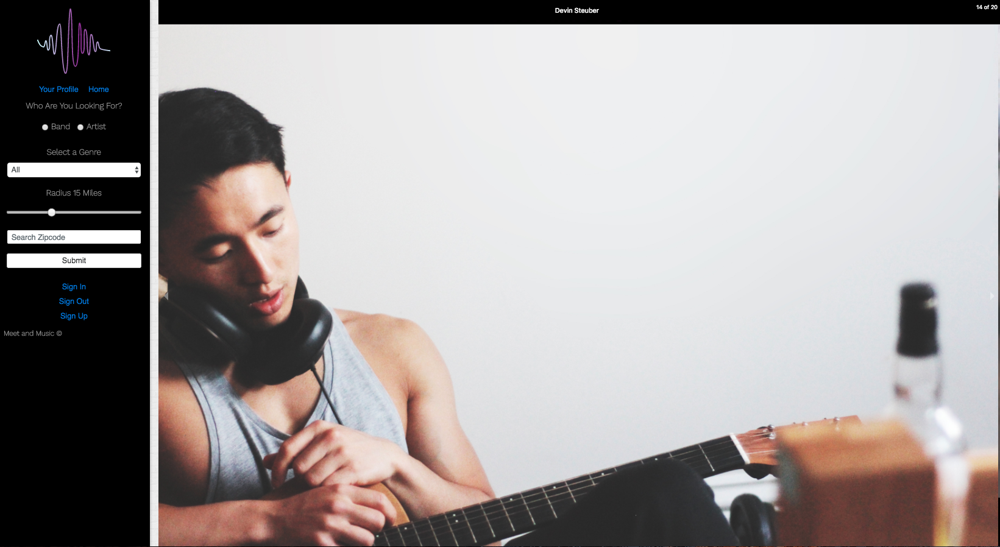
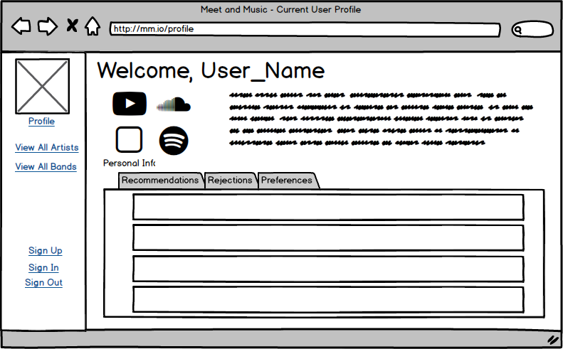
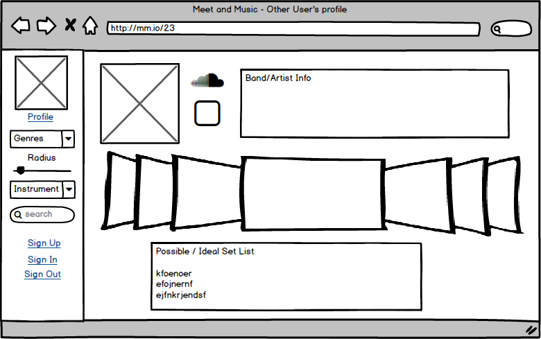

# Meet and Make Music

This application is a tool for musicians and bands to find each other. Application will provide talent recommendations, depending on the individual band/musician's location, musical need, and genre preference.

This application will be built on a Ruby on Rails backend and a Redux/React frontend.

[Link to Backend Repo](https://github.com/aisleypay/Meet-And-Music)

# Mockups

## Homepage

## User Private Profile

## User Public Profile

